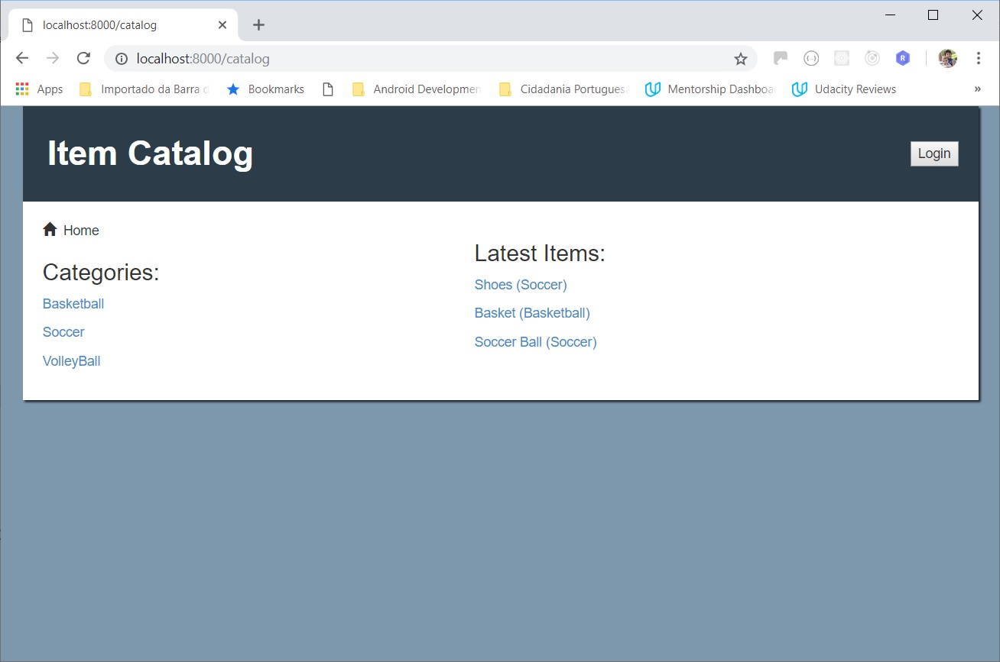
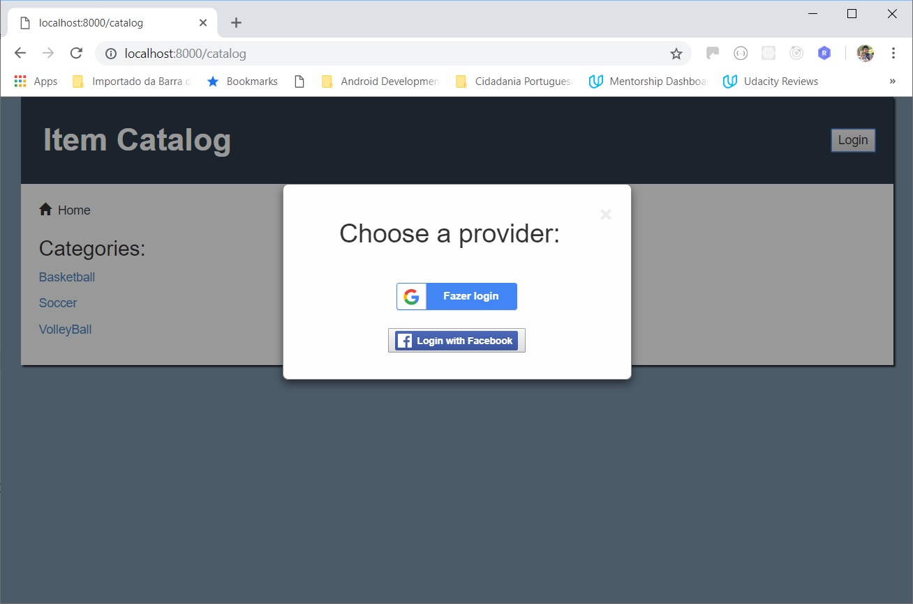
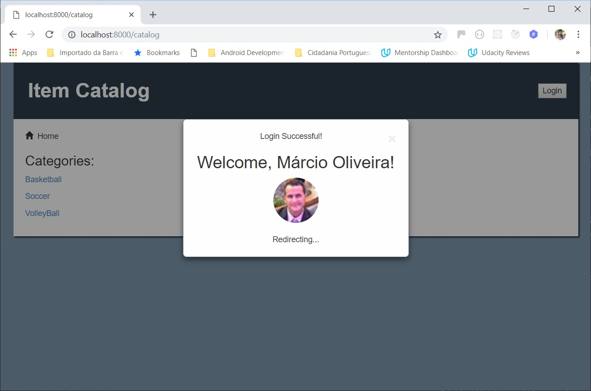
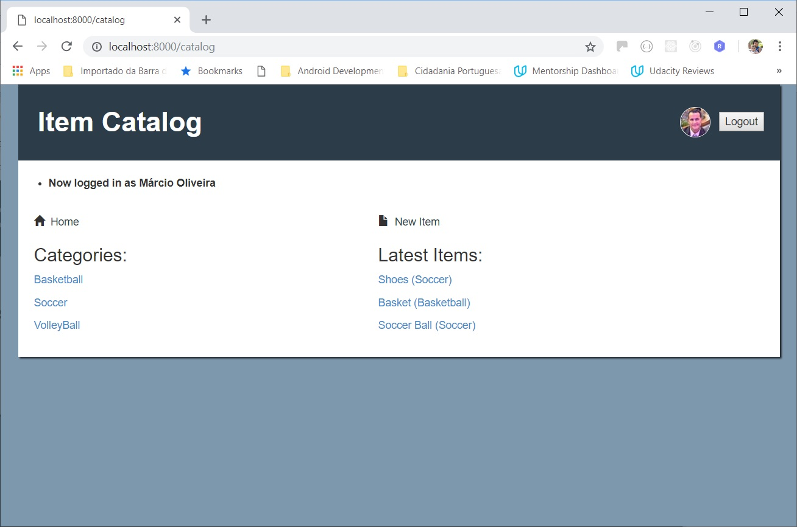
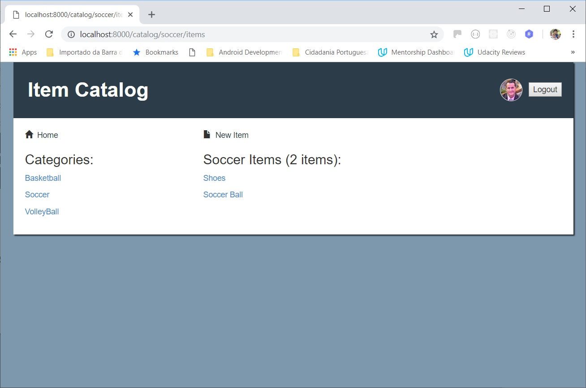
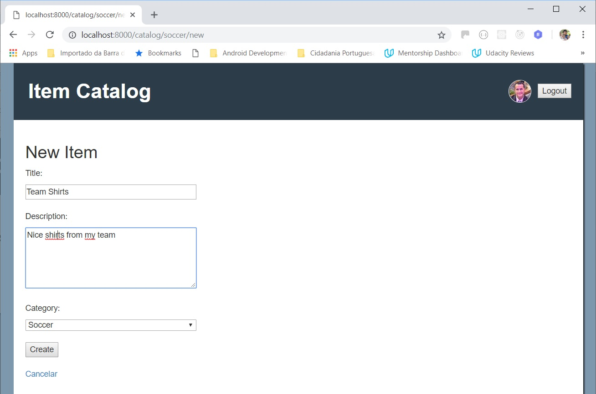
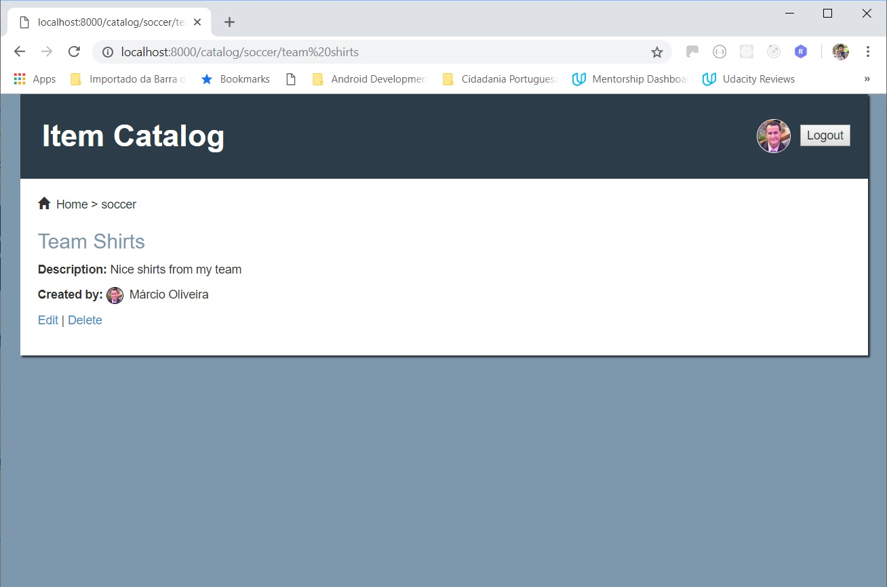
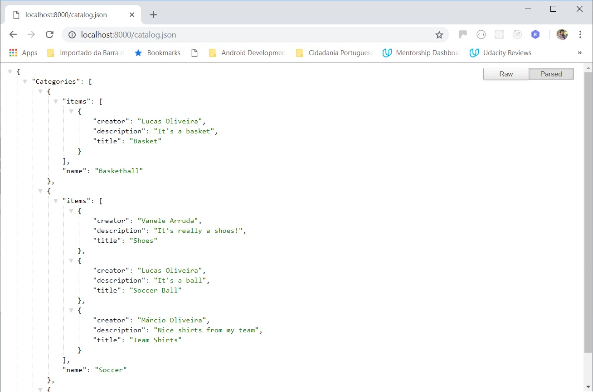

# Udacity Full-Stack Developer (Projeto 4) - Catálogo de Itens

Neste projeto temos um aplicativo que fornece uma lista de itens em uma variedade de categorias, bem como um sistema de registro e autenticação de usuários. Usuários registrados terão a capacidade de postar, editar e excluir seus próprios itens.

O aplicativo também oferece uma API onde o usuário poderá obter dados do catálogo num formato JSON conforme o [endpoint](README.md#Endpoints-do-Servidor) utilizado.

**Imagens:**

<table align="center">
  <tr>
     <td>
       
       
Tela Inicial

     </td>
     <td>
       
       
Autenticação via Google ou Facebook

     </td>
  </tr>
  <tr>
     <td>
       
       
Usuário autenticado

     </td>
     <td>
       
       
Tela inicial (usuário logado)

     </td>
  </tr>
  <tr>
     <td>
       
       
Itens de uma categoria

     </td>
     <td>
       
       
Criação de um novo item

    </td>
  </tr>
  <tr>
     <td>
       
       
Detalhes de um item

     </td>
     <td>
       
       
Retorno JSON da API

    </td>
  </tr>
</table>

## Arquitetura:

O backend foi desenvolvido com o framework [Flask](http://flask.pocoo.org/) em Python utilizando [SQLAlchemy](https://www.sqlalchemy.org/) como ORM para definir a base de dados.

O processo de autenticação é feito utilizando a API's do [Google](https://developers.google.com/identity/sign-in/web/) e [Facebook](https://developers.facebook.com/docs/graph-api/), portanto é necessário que o usuário possua uma conta em um desses sites para poder utilizar o app desde que não há um mecanismo próprio de autenticação implementado.

**OBS1:** Também é necessário criar chaves de API nesses 2 serviços para instalar e rodar o app corretamente (maiores instruções na próxima seção).

**OBS2** Na versão atual do aplicativo, não é possível criar ou alterar as categorias existentes, apenas os ítens em cada categoria. Caso haja necessidade de incluir novas categorias, pode ser feito manualmente, durante a instalação do banco de dados, conforme instruções na próxima seção.

A ferramenta foi desenvolvida e testada numa máquina virtual (VM) disponibilizada pela Udacity para o curso que roda o sistema operacional Linux e já possui o Python com as dependências necessárias já instalados.

## Instalação:

* Instale o [Git Bash](https://git-scm.com/downloads), [Vagrant](https://www.vagrantup.com/) e [VirtualBox](https://www.virtualbox.org/wiki/Downloads) (necessários para executar a VM). **OBS:** Em máquinas com Linux ou MacOS o Git Bash não é necessário
* Faça o [download](https://d17h27t6h515a5.cloudfront.net/topher/2017/June/5948287e_fsnd-virtual-machine/fsnd-virtual-machine.zip) da máquina virtual da Udacity e descompacte o arquivo numa pasta local
* Abra o Git Bash (ou um terminal UNIX), acesse a pasta da VM e acesse a subpasta `vagrant`
* Execute os comandos abaixo para fazer a instalação e efetuar o login na VM (leva alguns minutos todo o processo)
    - `vagrant up`
    - `vagrant ssh`
* Faça um clone do repositório para uma pasta dentro da mesma subpasta `vagrant` que é compartilhada com a VM.
* Volte no terminal da VM e crie o banco de dados com as categorias pré-definidas:
    - `cd /vagrant`
    - `cd <pasta clonada do repositório>`
    - `python database_setup.py`

    **OBS:** Se quiser adicionar mais categorias, basta editar o arquivo `database_setup` e adicioná-las manualmente antes de executar os comandos acima.
* Crie uma chave de API no [console do desenvolvedor Google](https://console.developers.google.com/apis) e crie um ID do cliente OAuth para a mesma, configure uma tela de consentimento (informe nome da aplicação e e-mail), selecione "Aplicação Web" como tipo de aplicação e adicione `http://localhost:8000` como "Origens JavaScript autorizadas" e também `http://localhost:8000` e `http://localhost:8000/gconnect` como "URIs de redirecionamento autorizados"
* Faça o download do arquivo JSON gerado no passo acima, renomeie como `client-secrets.json` e coloque na pasta clonada do repositório.
* Crie uma chave de API no [console do desenvolvedor Facebook](https://developers.facebook.com/), adicione o produto "Login do Facebook", siga os passos do "Início rápido" escolhendo a plataforma "Web" e configure a "URIs de redirecionamento do OAuth válidos" com `https://localhost:8000`.
* Crie um arquivo `fb_client_secrets.json` e coloque o número do ID do aplicativo obtido no passo acima nesse formato:

  `{'web':{'client_id':'<INFORMAR_AQUI>'}}`
* Inicialize o servidor:
    - `python server.py`
* Acesse a aplicação em seu navegador:
    - `http://localhost:8000`

## Endpoints do Servidor

#### Navegação
- `/` ou `/catalog` - Exibe todo as categorias do catálogo e os itens mais recentes (limitado aos 10 últimos).
- `/catalog/<category_name>` - Exibe todos os itens da categoria informada.
- `/catalog/<category_name>/items` - Mesmo que o anterior.
- `/catalog/<category_name>/<item_name>` - Exibe os detalhes do item informado.

#### Edição do catálogo (requer usuário autenticado)
- `/catalog/new` - Exibe o formulário de inclusão de um item.
- `/catalog/<category_name>/new` - Exibe o formulário de inclusão de um item na categoria informada.
- `/catalog/<category_name>/<item_name>/edit` - Exibe o formulário de edição do item informado.
- `/catalog/<category_name>/<item_name>/delete` - Exibe o formulário de confirmação para deleção do item informado.

#### API
- `/catalog.json` - Retorna um JSON com todas as categorias e respectivos itens.
- `/catalog/<category_name>.json` - Retorna um JSON com todas os itens da categoria informada.
- `/catalog/latest.json[?limit=xx]` - Retorna um JSON com os últimos itens adicionados e respectivas categorias. A quantidade padrão de itens retornados é 10, mas pode ser configurado com o parâmetro `limit=xx`.

## Copyright

Esse projeto foi desenvolvido por Márcio Souza de Oliveira e a VM foi disponibilizada pela Udacity
